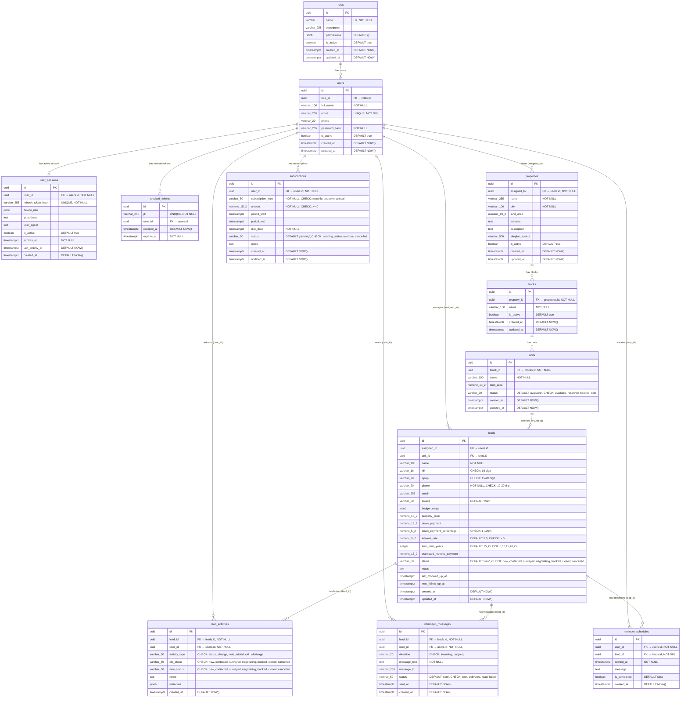

# ERD - Dashboard Management

# ERD - Dashboard Management

---

## 1. Overview

Dokumen ini berisi **Entity Relationship Diagram (ERD)** lengkap untuk sistem CRM Sales Force Automation menggunakan format Mermaid chart.

### Database Information

- **DBMS:** PostgreSQL 15+
- **Database Name:** sales_force_db
- **Total Tables:** 12 core tables
- **Relationships:** One-to-Many, Many-to-One
- **Extensions:** uuid-ossp, btree_gist

### Related Documents

- BRD: Sales Force Automation System
- FSD: Sales Force Automation System

---

## 2. Complete ERD (Mermaid)



---

## 3. Entity Details

### 3.1 Roles Table

**Purpose:** Menyimpan data role/hak akses pengguna sistem.

| Column | Type | Constraints | Description |
| --- | --- | --- | --- |
| id | UUID | PRIMARY KEY | Unique identifier |
| name | VARCHAR(50) | UNIQUE, NOT NULL | Nama role (Admin, Supervisor, Sales) |
| description | VARCHAR(255) | NULLABLE | Deskripsi role |
| permissions | JSONB | DEFAULT ‘{}’ | Daftar permissions role |
| is_active | BOOLEAN | DEFAULT true | Status aktif role |
| created_at | TIMESTAMPTZ | DEFAULT NOW() | Waktu pembuatan |
| updated_at | TIMESTAMPTZ | DEFAULT NOW() | Waktu terakhir update |

**Default Roles (Seeded):**

| Name | Description | Permissions |
| --- | --- | --- |
| Admin | Full system access | dashboard, leads, analytics, properties, settings, users, subscriptions |
| Supervisor | Can manage team and view all leads | dashboard, leads, analytics, properties, settings, users |
| Sales | Can manage assigned leads and properties | dashboard, leads, analytics, properties, settings |

**Relationships:**

- One-to-Many dengan **users** (role_id)

**JSONB Structure - permissions:**

```json
{
  "access": ["dashboard", "leads", "analytics", "properties", "settings"]
}
```

---

### 3.2 Users (Sales/Agent)

**Purpose:** Menyimpan data sales/agent yang menggunakan sistem.

| Column | Type | Constraints | Description |
| --- | --- | --- | --- |
| id | UUID | PRIMARY KEY | Unique identifier |
| role_id | UUID | FK → roles.id, ON DELETE SET NULL | Reference ke role |
| full_name | VARCHAR(100) | NOT NULL | Nama lengkap sales |
| email | VARCHAR(255) | UNIQUE, NOT NULL | Email untuk login |
| phone | VARCHAR(20) | NULLABLE | Nomor telepon sales |
| password_hash | VARCHAR(255) | NOT NULL | Password yang di-hash (bcrypt) |
| is_active | BOOLEAN | DEFAULT true | Status aktif/non-aktif |
| created_at | TIMESTAMPTZ | DEFAULT NOW() | Waktu pembuatan akun |
| updated_at | TIMESTAMPTZ | DEFAULT NOW() | Waktu terakhir update |

**Constraints:**

- Email harus unique untuk setiap user
- Email harus format valid: `^[A-Za-z0-9._%+-]+@[A-Za-z0-9.-]+\.[A-Z|a-z]{2,}$`
- Password disimpan dalam bentuk hash
- Soft delete menggunakan `is_active`
- User yang sudah ada otomatis di-assign ke role ‘Sales’ saat migration

**Relationships:**

- Many-to-One dengan **roles** (role_id)
- One-to-Many dengan **properties** (assigned_to)
- One-to-Many dengan **leads** (assigned_to)
- One-to-Many dengan **lead_activities** (user_id)
- One-to-Many dengan **whatsapp_messages** (user_id)
- One-to-Many dengan **reminder_schedules** (user_id)
- One-to-Many dengan **user_sessions** (user_id)
- One-to-Many dengan **revoked_tokens** (user_id)
- One-to-Many dengan **subscriptions** (user_id)

---

### 3.3 User Sessions Table

**Purpose:** Menyimpan sesi aktif user untuk implementasi refresh token rotation dan session activity tracking.

| Column | Type | Constraints | Description |
| --- | --- | --- | --- |
| id | UUID | PRIMARY KEY | Unique identifier |
| user_id | UUID | FK → users.id, NOT NULL, ON DELETE CASCADE | Reference ke user |
| refresh_token_hash | VARCHAR(255) | UNIQUE, NOT NULL | Hash dari refresh token |
| device_info | JSONB | NULLABLE | Info device (type, OS, browser) |
| ip_address | INET | NULLABLE | IP address saat login |
| user_agent | TEXT | NULLABLE | User agent string |
| is_active | BOOLEAN | DEFAULT true | Status session aktif/non-aktif |
| expires_at | TIMESTAMPTZ | NOT NULL | Expiry time refresh token (7 hari) |
| last_activity_at | TIMESTAMPTZ | DEFAULT NOW() | Tracking activity terakhir |
| created_at | TIMESTAMPTZ | DEFAULT NOW() | Waktu session dibuat |

**JSONB Structure - device_info:**

```json
{
  "device_type": "desktop|mobile|tablet",
  "os": "Windows|macOS|Linux|iOS|Android",
  "browser": "Chrome|Firefox|Safari|Edge"
}
```

**Note:**
- Single device login dihandle pada application layer dengan menonaktifkan session lama saat login baru
- Session cleanup dilakukan secara periodik untuk menghapus session yang sudah expired

---

### 3.4 Revoked Tokens Table

**Purpose:** Blacklist JWT yang di-revoke sebelum expiry (untuk keamanan).

| Column | Type | Constraints | Description |
| --- | --- | --- | --- |
| id | UUID | PRIMARY KEY | Unique identifier |
| jti | VARCHAR(255) | UNIQUE, NOT NULL | JWT ID dari token yang di-revoke |
| user_id | UUID | FK → users.id, ON DELETE CASCADE | Reference ke user |
| revoked_at | TIMESTAMPTZ | DEFAULT NOW() | Waktu token di-revoke |
| expires_at | TIMESTAMPTZ | NOT NULL | Expiry time original JWT |

**Note:**
- `user_id` nullable untuk mendukung revoked token dari user yang sudah dihapus
- Token yang sudah melewati `expires_at` bisa dihapus via cleanup job

---

### 3.5 Properties (Katalog Properti/Cluster)

**Purpose:** Menyimpan data induk properti atau cluster perumahan. Setiap properti wajib di-assign ke sales tertentu. Detail spesifik rumah ada di level `units`.

| Column | Type | Constraints | Description |
| --- | --- | --- | --- |
| id | UUID | PRIMARY KEY | Unique identifier |
| assigned_to | UUID | FK → users.id, NOT NULL, ON DELETE CASCADE | Sales yang menangani properti ini |
| name | VARCHAR(255) | NOT NULL | Nama properti/cluster (contoh: Grand Permata Residence) |
| city | VARCHAR(100) | NOT NULL | Kota lokasi properti |
| land_area | NUMERIC(10,2) | NULLABLE | Total luas tanah keseluruhan (m²) |
| address | TEXT | NULLABLE | Alamat lengkap properti |
| description | TEXT | NULLABLE | Deskripsi umum properti |
| siteplan_assets | VARCHAR(500) | NULLABLE | URL atau path file gambar siteplan |
| is_active | BOOLEAN | DEFAULT true | Status aktif properti |
| created_at | TIMESTAMPTZ | DEFAULT NOW() | Waktu pembuatan |
| updated_at | TIMESTAMPTZ | DEFAULT NOW() | Waktu terakhir update |

**Relationships:**

- Many-to-One dengan **users** (assigned_to)
- One-to-Many dengan **blocks** (property_id)

---

### 3.6 Blocks (Blok/Cluster di dalam Properti)

**Purpose:** Menyimpan data pengelompokan unit di dalam sebuah properti (contoh: Block A, Block B).

| Column | Type | Constraints | Description |
| --- | --- | --- | --- |
| id | UUID | PRIMARY KEY | Unique identifier |
| property_id | UUID | FK → properties.id, NOT NULL, ON DELETE CASCADE | Property induk |
| name | VARCHAR(100) | NOT NULL | Nama block (contoh: Block Anggrek, Block A) |
| is_active | BOOLEAN | DEFAULT true | Status aktif block |
| created_at | TIMESTAMPTZ | DEFAULT NOW() | Waktu pembuatan |
| updated_at | TIMESTAMPTZ | DEFAULT NOW() | Waktu terakhir update |

**Constraints:**

- Unique constraint: `(property_id, name)` - nama block harus unik di dalam satu properti.

**Relationships:**

- Many-to-One dengan **properties** (property_id)
- One-to-Many dengan **units** (block_id)

---

### 3.7 Units (Unit Rumah Spesifik)

**Purpose:** Menyimpan data unit spesifik yang dijual. Status unit dikontrol otomatis oleh trigger berdasarkan status lead yang terkait.

| Column | Type | Constraints | Description |
| --- | --- | --- | --- |
| id | UUID | PRIMARY KEY | Unique identifier |
| block_id | UUID | FK → blocks.id, NOT NULL, ON DELETE CASCADE | Block induk |
| name | VARCHAR(100) | NOT NULL | Nama unit (contoh: A-1, A-2) |
| land_area | NUMERIC(10,2) | NULLABLE | Luas tanah unit spesifik (m²) |
| status | VARCHAR(20) | DEFAULT ‘available’ | Status ketersediaan unit |
| created_at | TIMESTAMPTZ | DEFAULT NOW() | Waktu pembuatan |
| updated_at | TIMESTAMPTZ | DEFAULT NOW() | Waktu terakhir update |

**Unit Status Values:**

| Value | Description | Pemicu Otomatis dari Lead |
| --- | --- | --- |
| `available` | Unit tersedia untuk dijual | Lead di-cancel / tidak ada lead aktif |
| `reserved` | Unit sedang diproses / dinegosiasi | Lead status: *new, contacted, surveyed, negotiating* |
| `booked` | Unit sudah dibayar booking fee | Lead status: *booked* |
| `sold` | Unit sudah terjual akad | Lead status: *closed* |

**Constraints:**

- Unique constraint: `(block_id, name)` - nama unit harus unik di dalam satu block.
- CHECK constraint: `status IN ('available', 'reserved', 'booked', 'sold')`

**Relationships:**

- Many-to-One dengan **blocks** (block_id)
- One-to-Many dengan **leads** (unit_id)

**Unit to Lead status:**

```jsx
Lead Status          │  Unit Status   │  Alasan
─────────────────────┼────────────────┼──────────────────────────────────
NEW                  │  RESERVED      │  Minat awal, tandai unit
CONTACTED            │  RESERVED      │  Komunikasi awal
SURVEYED             │  RESERVED      │  Sudah lihat lokasi
NEGOTIATING          │  RESERVED      │  Masih negosiasi, belum bayar
BOOKED               │  BOOKED        │  Sudah bayar booking fee
CLOSED               │  SOLD          │  Akad selesai
CANCELLED            │  AVAILABLE*    │  Kembali tersedia
```

---

### 3.8 Leads (Prospects/Customers)

**Purpose:** Menyimpan data calon pembeli (leads). Leads sekarang berelasi langsung dengan `units`, bukan `properties`.

| Column | Type | Constraints | Description |
| --- | --- | --- | --- |
| id | UUID | PRIMARY KEY | Unique identifier |
| assigned_to | UUID | FK → users.id, ON DELETE SET NULL | Sales yang bertanggung jawab |
| unit_id | UUID | FK → units.id, ON DELETE SET NULL | Unit spesifik yang diminati |
| name | VARCHAR(100) | NOT NULL | Nama calon pembeli |
| nik | VARCHAR(16) | CHECK: 16 digit angka | Nomor NIK |
| npwp | VARCHAR(20) | CHECK: 15-20 digit angka | Nomor NPWP |
| phone | VARCHAR(20) | NOT NULL, CHECK: 10-20 digit angka | Nomor WhatsApp/HP |
| email | VARCHAR(255) | NULLABLE | Email calon pembeli |
| source | VARCHAR(50) | DEFAULT ‘Visit’ | Sumber lead |
| budget_range | JSONB | NULLABLE | Range budget {min, max} |
| property_price | NUMERIC(15,2) | NULLABLE | Harga properti |
| down_payment | NUMERIC(15,2) | NULLABLE | Jumlah DP dalam rupiah |
| down_payment_percentage | NUMERIC(5,2) | CHECK: 1-100% | Persentase DP |
| interest_rate | NUMERIC(5,2) | DEFAULT 5.5, CHECK: > 0 | Suku bunga KPR |
| loan_term_years | INTEGER | DEFAULT 15, CHECK: 5,10,15,20,25 | Tenor pinjaman (tahun) |
| estimated_monthly_payment | NUMERIC(15,2) | NULLABLE | Estimasi cicilan per bulan |
| status | VARCHAR(50) | only: `new`, `contacted`, `surveyed`, `negotiating`, `booked`, `closed`, `cancelled` | Status proses lead |
| notes | TEXT | NULLABLE | Catatan tambahan |
| last_followed_up_at | TIMESTAMPTZ | NULLABLE | Waktu terakhir follow-up |
| next_follow_up_at | TIMESTAMPTZ | NULLABLE | Jadwal follow-up berikutnya |
| created_at | TIMESTAMPTZ | DEFAULT NOW() | Waktu lead dibuat |
| updated_at | TIMESTAMPTZ | DEFAULT NOW() | Waktu terakhir update |

**Constraints Detail:**

- `status` hanya boleh: `new`, `contacted`, `surveyed`, `negotiating`, `booked`, `closed`, `cancelled`

**Status Flow:**

```
new → contacted → surveyed → negotiating → booked → closed
  └─────────────────────────────────────────────────→ cancelled
```

**Relationships:**

- Many-to-One dengan **users** (assigned_to)
- Many-to-One dengan **units** (unit_id)
- One-to-Many dengan **lead_activities** (lead_id)
- One-to-Many dengan **whatsapp_messages** (lead_id)
- One-to-Many dengan **reminder_schedules** (lead_id)

**JSONB Structure - budget_range:**

```json
{
  "min": 500000000,
  "max": 1000000000
}
```

---

### 3.9 Lead Activities Table

**Purpose:** Audit trail & history untuk semua aktivitas yang terjadi pada lead.

| Column | Type | Constraints | Description |
| --- | --- | --- | --- |
| id | UUID | PRIMARY KEY | Unique identifier |
| lead_id | UUID | FK → leads.id, NOT NULL, ON DELETE CASCADE | Reference ke lead |
| user_id | UUID | FK → users.id, NOT NULL, ON DELETE CASCADE | User yang melakukan aktivitas |
| activity_type | VARCHAR(50) | NOT NULL, CHECK: status_change, note_added, call, whatsapp | Tipe aktivitas |
| old_status | VARCHAR(50) | CHECK: new, contacted, surveyed, negotiating, closed, cancelled | Status sebelumnya |
| new_status | VARCHAR(50) | CHECK: new, contacted, surveyed, negotiating, closed, cancelled | Status setelahnya |
| notes | TEXT | NULLABLE | Catatan aktivitas |
| metadata | JSONB | NULLABLE | Data tambahan |
| created_at | TIMESTAMPTZ | DEFAULT NOW() | Waktu aktivitas dibuat |

**Activity Type Values:**

| Value | Description |
| --- | --- |
| status_change | Perubahan status lead |
| note_added | Penambahan catatan |
| call | Panggilan telepon |
| whatsapp | Aktivitas WhatsApp |

**Relationships:**

- Many-to-One dengan **leads** (lead_id)
- Many-to-One dengan **users** (user_id)

---

### 3.10 WhatsApp Messages Table

**Purpose:** Menyimpan log pesan WhatsApp untuk komunikasi dengan leads.

| Column | Type | Constraints | Description |
| --- | --- | --- | --- |
| id | UUID | PRIMARY KEY | Unique identifier |
| lead_id | UUID | FK → leads.id, NOT NULL, ON DELETE CASCADE | Reference ke lead |
| user_id | UUID | FK → users.id, NOT NULL, ON DELETE CASCADE | User yang mengirim/menerima |
| direction | VARCHAR(20) | NOT NULL, CHECK: incoming, outgoing | Arah pesan |
| message_text | TEXT | NOT NULL | Isi pesan |
| message_id | VARCHAR(255) | NULLABLE | ID pesan dari WhatsApp API |
| status | VARCHAR(50) | DEFAULT ‘sent’, CHECK: sent, delivered, read, failed | Status pengiriman |
| sent_at | TIMESTAMPTZ | DEFAULT NOW() | Waktu pesan dikirim |
| created_at | TIMESTAMPTZ | DEFAULT NOW() | Waktu record dibuat |

**Direction Values:**

| Value | Description |
| --- | --- |
| incoming | Pesan dari lead |
| outgoing | Pesan dari sales |

**Status Values:**

| Value | Description |
| --- | --- |
| sent | Pesan terkirim ke server |
| delivered | Pesan diterima di perangkat |
| read | Pesan sudah dibaca |
| failed | Gagal mengirim |

**Relationships:**

- Many-to-One dengan **leads** (lead_id)
- Many-to-One dengan **users** (user_id)

---

### 3.11 Reminder Schedules Table

**Purpose:** Menyimpan jadwal follow-up reminder untuk sales.

| Column | Type | Constraints | Description |
| --- | --- | --- | --- |
| id | UUID | PRIMARY KEY | Unique identifier |
| user_id | UUID | FK → users.id, NOT NULL, ON DELETE CASCADE | Sales yang memiliki reminder |
| lead_id | UUID | FK → leads.id, NOT NULL, ON DELETE CASCADE | Lead yang akan di-follow up |
| remind_at | TIMESTAMPTZ | NOT NULL | Waktu reminder |
| message | TEXT | NULLABLE | Pesan/konteks reminder |
| is_completed | BOOLEAN | DEFAULT false | Status selesai |
| created_at | TIMESTAMPTZ | DEFAULT NOW() | Waktu reminder dibuat |

**Relationships:**

- Many-to-One dengan **users** (user_id)
- Many-to-One dengan **leads** (lead_id)

---

### 3.12 Subscriptions Table

**Purpose:** Menyimpan data subscription user untuk akses sistem.

| Column | Type | Constraints | Description |
| --- | --- | --- | --- |
| id | UUID | PRIMARY KEY | Unique identifier |
| user_id | UUID | FK → users.id, NOT NULL, ON DELETE CASCADE | Reference ke user |
| subscription_type | VARCHAR(50) | NOT NULL, CHECK: monthly, quarterly, annual | Tipe subscription |
| amount | NUMERIC(15,2) | NOT NULL, CHECK: >= 0 | Jumlah pembayaran |
| period_start | TIMESTAMPTZ | NULLABLE | Mulai periode subscription |
| period_end | TIMESTAMPTZ | NULLABLE | Akhir periode subscription |
| due_date | TIMESTAMPTZ | NOT NULL | Tanggal jatuh tempo |
| status | VARCHAR(50) | DEFAULT ‘pending’, CHECK: pending, active, overdue, cancelled | Status subscription |
| notes | TEXT | NULLABLE | Catatan subscription |
| created_at | TIMESTAMPTZ | DEFAULT NOW() | Waktu pembuatan |
| updated_at | TIMESTAMPTZ | DEFAULT NOW() | Waktu terakhir update |

**Constraints:**

- `subscription_type` hanya boleh: `monthly`, `quarterly`, `annual`
- `status` hanya boleh: `pending`, `active`, `overdue`, `cancelled`
- `amount` harus >= 0
- Jika `period_start` dan `period_end` keduanya terisi, maka `period_end` harus > `period_start`

**Subscription Types & Periods:**

| subscription_type | Period | Description |
| --- | --- | --- |
| monthly | 1 bulan | Pembayaran per bulan |
| quarterly | 3 bulan | Pembayaran per 3 bulan |
| annual | 12 bulan | Pembayaran per tahun |

**Status Flow:**

```
pending → active → (renewal) → pending
   │
   └──→ overdue → (payment) → active
   │
   └──→ cancelled
```

**Business Rules:**

- Satu user bisa memiliki multiple subscription records (history)
- `period_start` dan `period_end` nullable untuk mendukung fleksibilitas saat pembuatan awal
- Jika `due_date` < NOW() dan status masih ‘pending’, otomatis jadi ‘overdue’ (via background job)
- User dengan status ‘overdue’ tidak bisa mengakses fitur tertentu

**Relationships:**

- Many-to-One dengan **users** (user_id)

---

## 4. Relationship Details

### 4.1 Users ↔︎ Properties (One-to-Many)

```
┌─────────────┐         ┌──────────────┐
│    users    │         │  properties  │
├─────────────┤         ├──────────────┤
│ id (PK)     │───────▶│ assigned_to  │
│ full_name   │   1:N  │ id (PK)      │
│ email       │         │ name         │
│ ...         │         │ city         │
└─────────────┘         └──────────────┘

Foreign Key: properties.assigned_to → users.id
ON DELETE: CASCADE
```

### 4.2 Properties ↔︎ Blocks (One-to-Many)

```
┌──────────────┐         ┌───────────┐
│  properties  │         │  blocks   │
├──────────────┤         ├───────────┤
│ id (PK)      │───────▶│ property_id│
│ name         │   1:N  │ id (PK)   │
│ city         │         │ name      │
└──────────────┘         └───────────┘

Foreign Key: blocks.property_id → properties.id
ON DELETE: CASCADE
```

### 4.3 Blocks ↔︎ Units (One-to-Many)

```
┌───────────┐         ┌───────────┐
│  blocks   │         │   units   │
├───────────┤         ├───────────┤
│ id (PK)   │───────▶│ block_id  │
│ name      │   1:N  │ id (PK)   │
└───────────┘         │ name      │
                      │ status    │
                      └───────────┘

Foreign Key: units.block_id → blocks.id
ON DELETE: CASCADE
```

### 4.4 Units ↔︎ Leads (One-to-Many)

```
┌───────────┐         ┌─────────────┐
│   units   │         │    leads    │
├───────────┤         ├─────────────┤
│ id (PK)   │───────▶│ unit_id     │
│ name      │   1:N  │ id (PK)     │
│ status    │         │ name        │
└───────────┘         │ status      │
                      └─────────────┘

Foreign Key: leads.unit_id → units.id
ON DELETE: SET NULL
```

**Business Rule:**

- Lead langsung memilih **unit spesifik** (bukan properti umum).
- Satu unit hanya boleh memiliki **satu lead aktif** (di-handle via partial unique index & trigger).
- Jika unit dihapus, `unit_id` di lead menjadi NULL.
- Perubahan status lead akan **mengubah status unit secara otomatis** via Database Trigger.

### 4.5 Users ↔︎ Leads (One-to-Many)

```
┌─────────────┐         ┌─────────────┐
│    users    │         │    leads    │
├─────────────┤         ├─────────────┤
│ id (PK)     │───────▶│ assigned_to │
│ full_name   │   1:N  │ id (PK)     │
│ email       │         │ name        │
│ ...         │         │ ...         │
└─────────────┘         └─────────────┘

Foreign Key: leads.assigned_to → users.id
ON DELETE: SET NULL
```

---

## 5. Database Extensions

| Extension | Purpose |
| --- | --- |
| uuid-ossp | Generate UUID v4 untuk primary keys |
| btree_gist | Support untuk GiST index (digunakan jika ingin implementasi EXCLUDE constraint di masa depan) |

---

## 6. Index Summary

### Performance Indexes

| Table | Index Name | Column(s) | Purpose |
| --- | --- | --- | --- |
| users | idx_users_email | email | Lookup by email (login) |
| users | idx_users_is_active | is_active | Filter active users |
| users | idx_users_role_id | role_id | Filter by role |
| user_sessions | idx_user_sessions_user_id | user_id | Find sessions by user |
| user_sessions | idx_user_sessions_token_hash | refresh_token_hash | Token validation |
| user_sessions | idx_user_sessions_is_active | is_active | Filter active sessions |
| user_sessions | idx_user_sessions_expires_at | expires_at | Cleanup expired sessions |
| revoked_tokens | idx_revoked_tokens_jti | jti | Token blacklist check |
| revoked_tokens | idx_revoked_tokens_expires_at | expires_at | Cleanup expired tokens |
| properties | idx_properties_assigned_to | assigned_to | Filter by sales |
| properties | idx_properties_city | city | Filter by location |
| properties | idx_properties_is_active | is_active | Filter active properties |
| **blocks** | **idx_blocks_property_id** | **property_id** | **Find blocks by property** |
| **blocks** | **idx_blocks_property_name_unique** | **property_id, name** | **Unique block name per property** |
| **units** | **idx_units_block_id** | **block_id** | **Find units by block** |
| **units** | **idx_units_status** | **status** | **Filter by availability** |
| **units** | **idx_units_block_name_unique** | **block_id, name** | **Unique unit name per block** |
| leads | idx_leads_assigned_to | assigned_to | Filter by sales |
| **leads** | **idx_leads_unit_id** | **unit_id** | **Filter by unit** |
| leads | idx_leads_status | status | Filter by status |
| leads | idx_leads_created_at | created_at | Sorting by date |
| leads | idx_leads_source | source | Filter by source |
| leads | idx_leads_nik | nik | NIK lookup |
| leads | idx_leads_next_follow_up | next_follow_up_at (WHERE NOT NULL) | Reminder queries |
| lead_activities | idx_lead_activities_lead_id | lead_id | History lookup |
| lead_activities | idx_lead_activities_user_id | user_id | Filter by user |
| lead_activities | idx_lead_activities_created_at | created_at | Sorting |
| lead_activities | idx_lead_activities_type | activity_type | Filter by type |
| whatsapp_messages | idx_whatsapp_messages_lead_id | lead_id | Message history |
| whatsapp_messages | idx_whatsapp_messages_user_id | user_id | Filter by user |
| whatsapp_messages | idx_whatsapp_messages_created_at | created_at | Sorting |
| whatsapp_messages | idx_whatsapp_messages_status | status | Filter by status |
| reminder_schedules | idx_reminder_schedules_user_id | user_id | Filter by user |
| reminder_schedules | idx_reminder_schedules_lead_id | lead_id | Filter by lead |
| reminder_schedules | idx_reminder_schedules_remind_at | remind_at | Scheduled reminders |
| reminder_schedules | idx_reminder_schedules_is_completed | is_completed | Filter pending |
| roles | idx_roles_name | name | Role lookup |
| roles | idx_roles_is_active | is_active | Filter active roles |
| subscriptions | idx_subscriptions_user_id | user_id | Filter by user |
| subscriptions | idx_subscriptions_status | status | Filter by status |
| subscriptions | idx_subscriptions_subscription_type | subscription_type | Filter by type |
| subscriptions | idx_subscriptions_due_date | due_date | Overdue check |
| subscriptions | idx_subscriptions_period | period_start, period_end | Period overlap check |
| subscriptions | idx_subscriptions_created_at | created_at | Sorting |

---

*Document Version: 2.2*

*Last Updated: 2026-07-10*

*Database: PostgreSQL 15+*