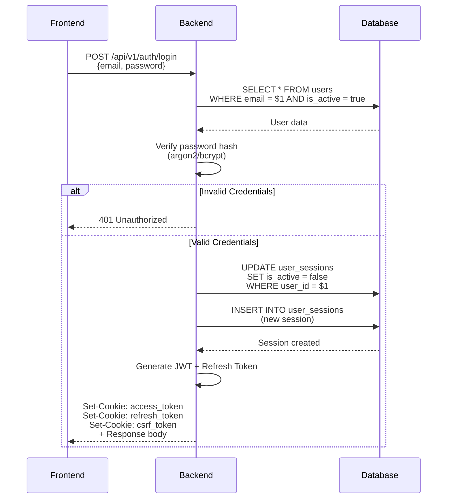
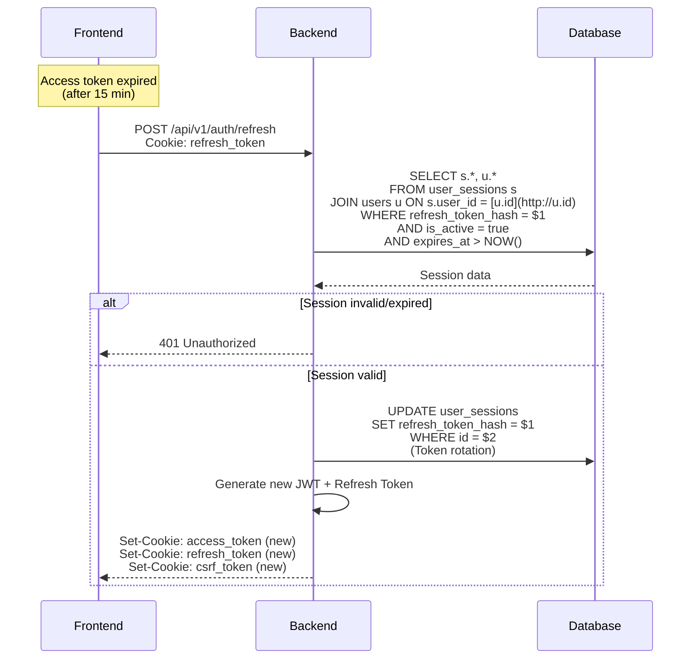
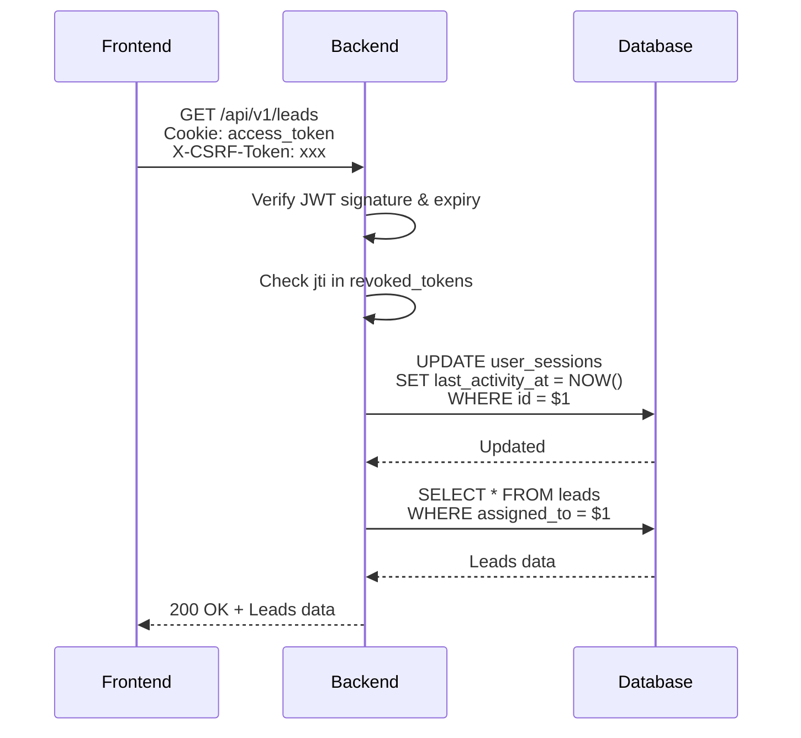
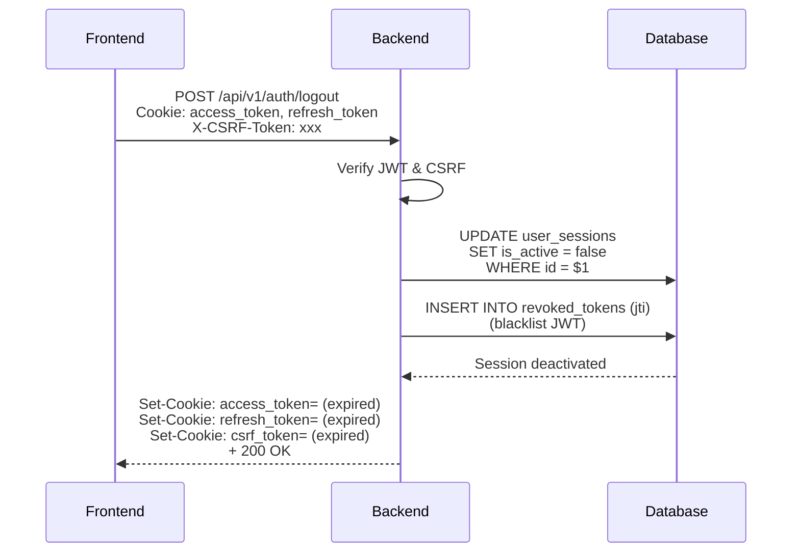

# API Design - Authentication & Session Management

---

## 1. Overview

This document provides a complete design for the authentication and session management system in the **Sales Force Automation System**, implementing **HTTP-only Cookies** for token security and a **Single Device Login** mechanism per account.

### Key Features

- ✅ HTTP-only Cookies for session management
- ✅ Refresh Token rotation for security
- ✅ Single Device Login (1 account = 1 active device)
- ✅ Password encryption with Argon2/bcrypt
- ✅ CSRF protection
- ✅ Session revocation capability

---

## 2. Database Schema Analysis

Based on the existing ERD, the following tables are relevant to authentication:

### 2.1 Existing `users` Table

| Column | Type | Usage in Auth |
| --- | --- | --- |
| `id` | UUID | User identifier in JWT payload |
| `full_name` | VARCHAR |  |
| `phone` | VARCHAR |  |
| `email` | VARCHAR(255) | Login identifier |
| `password_hash` | VARCHAR(255) | Hashed password (bcrypt) |
| `is_active` | BOOLEAN | Account status check |
| `created_at` | TIMESTAMPTZ | Audit trail |
| `updated_at` | TIMESTAMPTZ | Audit trail |

### 2.2 New Tables Required

To support HTTP-only cookies and single device login, 2 new tables need to be added:

#### `user_sessions` Table

```sql
CREATE TABLE user_sessions (
    id UUID PRIMARY KEY DEFAULT uuid_generate_v4(),
    user_id UUID NOT NULL REFERENCES users(id) ON DELETE CASCADE,
    refresh_token_hash VARCHAR(255) NOT NULL UNIQUE,
    device_info JSONB NOT NULL,
    ip_address INET,
    user_agent TEXT,
    is_active BOOLEAN DEFAULT true,
    expires_at TIMESTAMPTZ NOT NULL,
    last_activity_at TIMESTAMPTZ DEFAULT NOW(),
    created_at TIMESTAMPTZ DEFAULT NOW(),
    
    CONSTRAINT single_active_session_per_user 
        EXCLUDE (USING gist(user_id WITH =)) 
        WHERE (is_active = true)
);

CREATE INDEX idx_sessions_user_id ON user_sessions(user_id);
CREATE INDEX idx_sessions_refresh_token ON user_sessions(refresh_token_hash);
CREATE INDEX idx_sessions_expires_at ON user_sessions(expires_at);
CREATE INDEX idx_sessions_is_active ON user_sessions(is_active);
```

**JSONB Structure - device_info:**

#### `revoked_tokens` Table

```sql
CREATE TABLE revoked_tokens (
    id UUID PRIMARY KEY DEFAULT uuid_generate_v4(),
    jti VARCHAR(255) NOT NULL UNIQUE,
    user_id UUID NOT NULL REFERENCES users(id) ON DELETE CASCADE,
    revoked_at TIMESTAMPTZ DEFAULT NOW(),
    expires_at TIMESTAMPTZ NOT NULL
);

CREATE INDEX idx_revoked_jti ON revoked_tokens(jti);
CREATE INDEX idx_revoked_user_id ON revoked_tokens(user_id);
CREATE INDEX idx_revoked_expires_at ON revoked_tokens(expires_at);
```

---

## 3. API Endpoints

### 3.1 Login

| Attribute | Value |
| --- | --- |
| **Endpoint** | `POST /api/v1/auth/login` |
| **Description** | Authenticate user and create session |
| **Request Body** | JSON |
| **Response** | JSON + HTTP-only Cookies |

#### Request Body

```json
{
  "email": "[sales@example.com](mailto:sales@example.com)",
  "password": "SecurePass123!"
}
```

#### Response Headers

```
HTTP/1.1 200 OK
Set-Cookie: access_token=<JWT>; Path=/; Secure; HttpOnly; SameSite=Strict; Max-Age=900
Set-Cookie: refresh_token=<REFRESH_TOKEN>; Path=/api/v1/auth/refresh; Secure; HttpOnly; SameSite=Strict; Max-Age=604800
Set-Cookie: csrf_token=<CSRF_TOKEN>; Path=/; Secure; SameSite=Strict; Max-Age=900
```

#### Response Body

```json
{
  "success": true,
  "message": "Login successful",
  "data": {
    "user": {
      "full_name": "John Doe",
      "email": "john@example.com"
    },
    "session": {
      "id": 12,
      "device_info": {
        "browser": "Chrome",
        "os": "Windows",
        "device": "Desktop"
      },
      "expires_at": "2026-06-25T08:41:41.000Z"
    }
  }
}
```

#### Error Responses

**401 Unauthorized**

```json
{
  "success": false,
  "message": "Invalid email or password"
}
```

**403 Forbidden**

```json
{
  "success": false,
  "message": "Account is inactive. Please contact administrator."
}
```

---

### 3.2 Refresh Token

| Attribute | Value |
| --- | --- |
| **Endpoint** | `POST /api/v1/auth/refresh` |
| **Description** | Rotate access token using refresh token |
| **Request** | HTTP-only Cookie |
| **Response** | JSON + HTTP-only Cookies |

#### Request Headers

```
Cookie: refresh_token=<REFRESH_TOKEN>
```

#### Response Headers

```
HTTP/1.1 200 OK
Set-Cookie: access_token=<NEW_JWT>; Path=/; Secure; HttpOnly; SameSite=Strict; Max-Age=900
Set-Cookie: refresh_token=<NEW_REFRESH_TOKEN>; Path=/api/v1/auth/refresh; Secure; HttpOnly; SameSite=Strict; Max-Age=604800
Set-Cookie: csrf_token=<NEW_CSRF_TOKEN>; Path=/; Secure; SameSite=Strict; Max-Age=900
```

#### Response Body

```json
{
  "success": true,
  "data": {
    "csrf_token": "<NEW_CSRF_TOKEN>"
  }
}
```

#### Error Responses

**401 Unauthorized**

```json
{
  "success": false,
  "message": "Invalid or expired refresh token"
}
```

**403 Forbidden - Session Revoked**

```json
{
  "success": false,
  "message": "Session was revoked. Please login again."
}
```

---

### 3.3 Logout

| Attribute | Value |
| --- | --- |
| **Endpoint** | `POST /api/v1/auth/logout` |
| **Description** | Terminate current session |
| **Request** | HTTP-only Cookie + CSRF Token |
| **Response** | JSON + Cleared Cookies |

#### Request Headers

```
Cookie: access_token=<JWT>; refresh_token=<REFRESH_TOKEN>
X-CSRF-Token: <CSRF_TOKEN>
```

#### Response Headers

```
HTTP/1.1 200 OK
Set-Cookie: access_token=; Path=/; Secure; HttpOnly; SameSite=Strict; Max-Age=0
Set-Cookie: refresh_token=; Path=/api/v1/auth/refresh; Secure; HttpOnly; SameSite=Strict; Max-Age=0
Set-Cookie: csrf_token=; Path=/; Secure; SameSite=Strict; Max-Age=0
```

#### Response Body

```json
{
  "success": true,
  "message": "Logged out successfully"
}
```

---

### 3.4 Get Current Session

| Attribute | Value |
| --- | --- |
| **Endpoint** | `GET /api/v1/auth/me` |
| **Description** | Get current user session info |
| **Request** | HTTP-only Cookie |
| **Response** | JSON |

#### Request Headers

```
Cookie: access_token=<JWT>
```

#### Response Body

```json
{
  "success": true,
  "data": {
    "user": {
      "id": "uuid-here",
      "full_name": "John Doe",
      "email": "[john@example.com](mailto:john@example.com)",
      "phone": "+6281234567890"
    },
    "session": {
      "device_info": {
        "device_type": "desktop",
        "os": "Windows",
        "browser": "Chrome"
      },
      "last_activity_at": "2026-01-13T10:30:00Z",
      "expires_at": "2026-01-20T10:30:00Z"
    }
  }
}
```

---

### 3.5 Revoke All Sessions

| Attribute | Value |
| --- | --- |
| **Endpoint** | `POST /api/v1/auth/revoke-all` |
| **Description** | Revoke all active sessions (useful for security incidents) |
| **Request** | HTTP-only Cookie + CSRF Token |
| **Response** | JSON |

#### Request Headers

```
Cookie: access_token=<JWT>
X-CSRF-Token: <CSRF_TOKEN>
```

#### Response Body

```json
{
  "success": true,
  "message": "All sessions revoked successfully",
  "data": {
    "revoked_count": 3
  }
}
```

---

### 3.6 Register

| Attribute | Value |
| --- | --- |
| **Endpoint** | `POST /api/v1/auth/register` |
| **Description** | Register new account |
| **Request** | **JSON Body:**
  - `email` (String, Required)
  - `password` (String, Required)
  - `full_name` (String, Required)
  - `phone` (String, Optional) |
| **Response** | JSON |

#### Request Body

```json
{
  "email": "user@example.com",
  "password": "rahasiaPassword123",
  "full_name": "Budi Santoso",
  "phone": "081234567890"
}
```

#### **Response Body**

```json
{
    success: true,
    message: 'Registration successful. Please login.',
}
```

---

## 4. Security Implementation Details

### 4.1 Password Hashing

**Algorithm:** Argon2id (recommended) or bcrypt

**Configuration:**

```jsx
// Argon2id parameters (recommended)
const argon2Options = {
  type: argon2.argon2id,
  memoryCost: 65536,    // 64 MB
  timeCost: 3,           // Number of iterations
  parallelism: 4,        // Number of threads
  hashLength: 32         // 32 bytes output
}

// Bcrypt fallback options
const bcryptOptions = {
  saltRounds: 12         // 2^12 iterations
}
```

**Implementation Example:**

```jsx
import argon2 from 'argon2';

// Hash password on registration/password change
const hashPassword = async (password) => {
  return await argon2.hash(password, {
    type: argon2.argon2id,
    memoryCost: 65536,
    timeCost: 3,
    parallelism: 4,
    hashLength: 32
  });
};

// Verify password on login
const verifyPassword = async (hash, password) => {
  return await argon2.verify(hash, password);
};
```

### 4.2 JWT Token Structure

**Access Token (Short-lived)**

```json
{
  "jti": "unique-token-id",
  "sub": "user-uuid",
  "email": "[user@example.com](mailto:user@example.com)",
  "iat": 1736754000,
  "exp": 1736754900,
  "iss": "sales-force-api",
  "aud": "sales-force-web",
  "session_id": "session-uuid"
}
```

**Token Configuration:**

| Attribute | Access Token | Refresh Token |
| --- | --- | --- |
| **Algorithm** | HS256 or RS256 | Random string (256-bit) |
| **Expiration** | 15 minutes | 7 days |
| **Storage** | HTTP-only Cookie | HTTP-only Cookie |
| **Size** | ~500 bytes | 64 bytes |

### 4.3 Cookie Security Flags

```jsx
// Access Token Cookie
res.cookie('access_token', accessToken, {
  httpOnly: true,        // ✅ Prevent JavaScript access
  secure: true,          // ✅ HTTPS only
  sameSite: 'strict',    // ✅ CSRF protection
  path: '/',
  maxAge: 15 * 60 * 1000, // 15 minutes
  domain: '.[yourdomain.com](http://yourdomain.com)' // Optional: for subdomains
});

// Refresh Token Cookie
res.cookie('refresh_token', refreshToken, {
  httpOnly: true,
  secure: true,
  sameSite: 'strict',
  path: '/api/v1/auth/refresh', // Restricted path
  maxAge: 7 * 24 * 60 * 60 * 1000, // 7 days
  domain: '.[yourdomain.com](http://yourdomain.com)'
});

// CSRF Token Cookie (accessible by JS)
res.cookie('csrf_token', csrfToken, {
  secure: true,
  sameSite: 'strict',
  path: '/',
  maxAge: 15 * 60 * 1000
});
```

### 4.4 CSRF Protection Strategy

Since **SameSite=Strict** is used, CSRF risk is highly minimized. However, for defense-in-depth:

1. **CSRF Token Pattern** (Double Submit Cookie):
    - Server generates random CSRF token
    - Token is stored in a cookie (readable by JS)
    - Frontend must send the token in the header: `X-CSRF-Token`
    - Server validates cookie vs header
2. **State-Changing Methods Only**:
    - CSRF validation applies only to POST, PUT, DELETE, PATCH
    - GET requests do not require a CSRF token
3. **Implementation Example:**

```jsx
// Middleware CSRF validation
const validateCSRF = (req, res, next) => {
  if (['GET', 'HEAD', 'OPTIONS'].includes(req.method)) {
    return next();
  }
  
  const tokenCookie = req.cookies?.csrf_token;
  const tokenHeader = req.headers['x-csrf-token'];
  
  if (!tokenCookie || !tokenHeader || tokenCookie !== tokenHeader) {
    return res.status(403).json({
      success: false,
      message: 'Invalid CSRF token'
    });
  }
  
  next();
};
```

---

## 5. Single Device Login Implementation

### 5.1 Strategy

A **Database Constraint** is used to enforce single device login:

```sql
-- Exclusion constraint on user_sessions table
CONSTRAINT single_active_session_per_user 
    EXCLUDE (USING gist(user_id WITH =)) 
    WHERE (is_active = true)
```

### 5.2 Login Flow with Single Device

```jsx
const login = async (req, res) => {
  const { email, password } = req.body;
  
  // 1. Verify password
  const user = await findUserByEmail(email);
  if (!user || !await verifyPassword(user.password_hash, password)) {
    return res.status(401).json({ message: 'Invalid credentials' });
  }
  
  // 2. Deactivate existing session (if any)
  await db.query(
    'UPDATE user_sessions SET is_active = false WHERE user_id = $1 AND is_active = true',
    [[user.id](http://user.id)]
  );
  
  // 3. Create new session
  const sessionId = uuid();
  const refreshToken = generateRandomToken(64);
  const refreshTokenHash = await hashPassword(refreshToken);
  
  await db.query(
    `INSERT INTO user_sessions 
     (id, user_id, refresh_token_hash, device_info, ip_address, user_agent, expires_at)
     VALUES ($1, $2, $3, $4, $5, $6, $7)`,
    [sessionId, [user.id](http://user.id), refreshTokenHash, req.deviceInfo, req.ip, req.headers['user-agent'], new Date([Date.now](http://Date.now)() + 7*24*60*60*1000)]
  );
  
  // 4. Generate JWT
  const accessToken = generateJWT(user, sessionId);
  const csrfToken = generateCSRFToken();
  
  // 5. Set HTTP-only cookies
  res.cookie('access_token', accessToken, cookieOptions.access);
  res.cookie('refresh_token', refreshToken, cookieOptions.refresh);
  res.cookie('csrf_token', csrfToken, cookieOptions.csrf);
  
  // 6. Return response
  res.json({
    success: true,
    data: {
      user: sanitizeUser(user),
      csrf_token: csrfToken
    }
  });
};
```

---

## 6. Authentication Flow

### 6.1 Login Flow Sequence



### 6.2 Refresh Token Flow



### 6.3 API Request Flow (Authenticated)



### 6.4 Logout Flow



---

## 7. Frontend Implementation Guide

### 7.1 Handling HTTP-only Cookies

**Important:** The frontend does NOT need to manage access_token and refresh_token manually since they are stored in HTTP-only cookies.

**What the frontend needs to do:**

```tsx
// 1. Axios interceptor for CSRF token
const api = axios.create({
  baseURL: process.env.API_URL,
  withCredentials: true // Important for sending cookies
});

// Request interceptor: Add CSRF token from cookie
api.interceptors.request.use((config) => {
  const csrfToken = getCookie('csrf_token');
  if (['post', 'put', 'patch', 'delete'].includes(config.method?.toLowerCase())) {
    config.headers['X-CSRF-Token'] = csrfToken;
  }
  return config;
});

// Response interceptor: Handle 401 (token expired)
api.interceptors.response.use(
  (response) => response,
  async (error) => {
    const originalRequest = error.config;
    
    if (error.response?.status === 401 && !originalRequest._retry) {
      originalRequest._retry = true;
      
      try {
        // Attempt refresh token
        await [api.post](http://api.post)('/api/v1/auth/refresh');
        return api(originalRequest);
      } catch (refreshError) {
        // Refresh failed, redirect to login
        window.location.href = '/login';
        return Promise.reject(refreshError);
      }
    }
    
    return Promise.reject(error);
  }
);

// Helper function to read cookie
function getCookie(name: string): string {
  const value = `; ${document.cookie}`;
  const parts = value.split(`; ${name}=`);
  if (parts.length === 2) return parts.pop()?.split(';').shift() || '';
  return '';
}
```

### 7.2 Login Component Example

```tsx
import { api } from './api';
import { useState } from 'react';

export function LoginForm() {
  const [email, setEmail] = useState('');
  const [password, setPassword] = useState('');
  const [error, setError] = useState('');
  
  const handleSubmit = async (e: React.FormEvent) => {
    e.preventDefault();
    setError('');
    
    try {
      const response = await [api.post](http://api.post)('/api/v1/auth/login', {
        email,
        password
      });
      
      // Cookies automatically set by browser
      // Store CSRF token for subsequent requests
      localStorage.setItem('csrf_token', [response.data.data](http://response.data.data).csrf_token);
      
      // Redirect to dashboard
      window.location.href = '/dashboard';
    } catch (err: any) {
      setError(err.response?.data?.message || 'Login failed');
    }
  };
  
  return (
    <form onSubmit={handleSubmit}>
      {/* Form fields */}
    </form>
  );
}
```

---

## 8. Security Checklist

### ✅ Implemented

- [x]  HTTP-only cookies for access token
- [x]  HTTP-only cookies for refresh token
- [x]  Secure flag (HTTPS only)
- [x]  SameSite=Strict for CSRF protection
- [x]  Argon2id password hashing
- [x]  JWT signature verification
- [x]  Token expiration (15 min access, 7 days refresh)
- [x]  Refresh token rotation
- [x]  Token blacklist (revoked_tokens table)
- [x]  Single device login enforcement
- [x]  CSRF token for state-changing operations
- [x]  IP & User-Agent logging
- [x]  Session activity tracking

### 🔒 Additional Recommendations

1. **Rate Limiting**:
    - Login endpoint: 5 attempts per 15 minutes per IP
    - Refresh endpoint: 20 requests per minute per IP
2. **Account Lockout**:
    - Lock account after 5 failed login attempts
    - Unlock after 30 minutes or manual admin action
3. **Security Headers**:
    
    ```
    X-Content-Type-Options: nosniff
    X-Frame-Options: DENY
    X-XSS-Protection: 1; mode=block
    Strict-Transport-Security: max-age=31536000; includeSubDomains
    Content-Security-Policy: default-src 'self'
    ```
    
4. **Monitoring & Alerts**:
    - Alert for multiple failed logins
    - Alert for login from unusual location
    - Alert for session revocation
5. **Password Policy**:
    - Minimum 12 characters
    - Must include uppercase, lowercase, number, special char
    - Check against common password lists

---

## 9. Error Codes Reference

| Code | Message | Description |
| --- | --- | --- |
| `AUTH_001` | Invalid email or password | Credentials do not match |
| `AUTH_002` | Account inactive | Account is disabled |
| `AUTH_003` | Invalid or expired token | Token is invalid or expired |
| `AUTH_004` | Session revoked | Session was revoked by admin |
| `AUTH_005` | Session already exists on another device | User is logged in on another device |
| `AUTH_006` | Invalid CSRF token | CSRF token mismatch |
| `AUTH_007` | Too many login attempts | Rate limit exceeded |
| `AUTH_008` | Account locked | Account is locked due to failed attempts |

---

## 10. Related Documents

- [ERD - Sales Force Automation System](https://www.notion.so/ERD-Sales-Force-Automation-System-2e4b2c42720c81608681d8ec647c6954)
- [API Design - Leads](https://www.notion.so/API-Design-Leads-2e6b2c42720c81049249fe6f831ec771)
- [BRD - Sales Force Automation System](https://www.notion.so/BRD-Sales-Force-Automation-System-2e4b2c42720c819793e5c67df4e0172f)

---

*Document Version: 1.0*  

*Created: 2026-01-13*  

*Author: Senior Backend Engineer*  

*Status: Ready for Implementation*